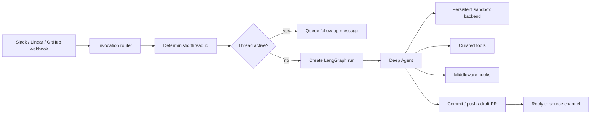
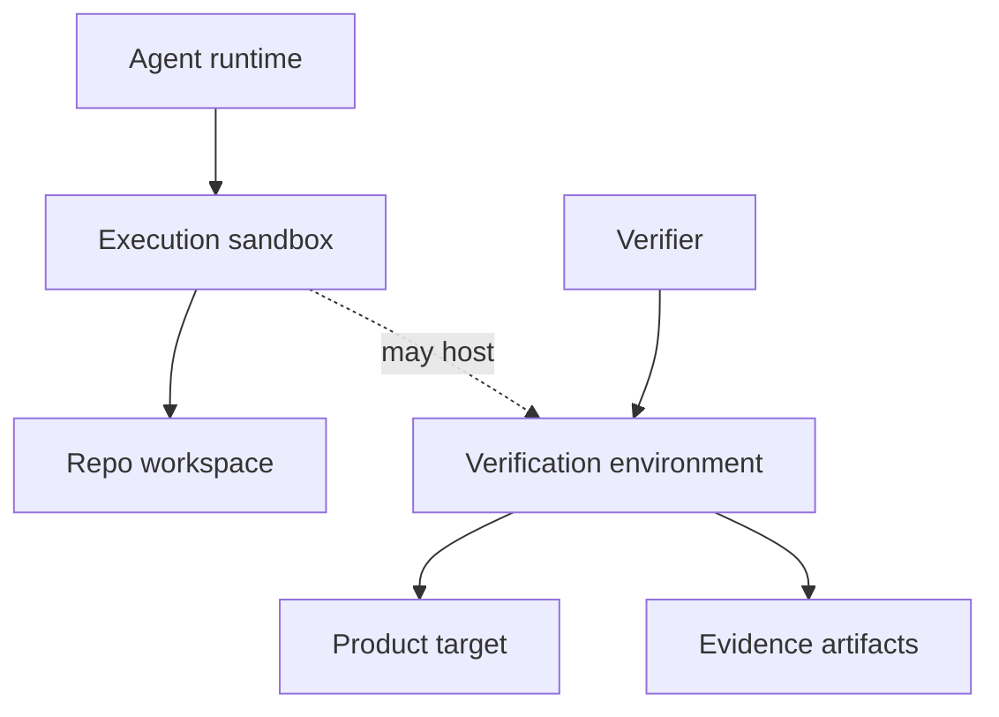
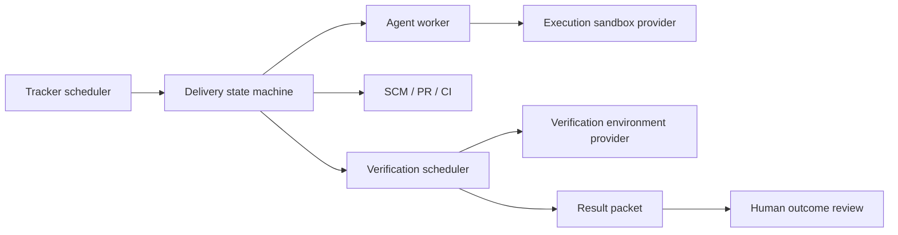

# Open SWE Research Notes For AO

**Status:** Draft  
**Author:** Agent Orchestrator  
**Date:** 2026-05-18  
**Scope:** Reference architecture study for AO's result-driven transformation

---

## Purpose

This document studies Open SWE as a reference implementation for AO's next architecture direction, especially:

- sandbox design
- invocation model
- middleware design
- organization customization
- whether sandboxing can solve AO's verification environment problem

Sources:

- [Open SWE repository](https://github.com/langchain-ai/open-swe)
- [Open SWE customization guide](https://github.com/langchain-ai/open-swe/blob/main/CUSTOMIZATION.md)
- [Open SWE installation guide](https://github.com/langchain-ai/open-swe/blob/main/INSTALLATION.md)

---

## Executive Takeaway

Open SWE is useful for AO, but not as a complete answer.

The strongest ideas to borrow are:

1. a pluggable sandbox backend protocol
2. persistent sandbox per task/thread
3. sandbox snapshots for preinstalled tooling
4. sandbox reconnect/recreate/circuit-breaker handling
5. credential proxying instead of writing real credentials into the sandbox
6. deterministic invocation routing from Slack, Linear, and GitHub
7. middleware hooks around the agent loop
8. org-level and repo-level customization surfaces

The main limitation is validation. Open SWE's default validation is still prompt-driven: the agent is told to run related tests before submitting. Its own docs present deterministic CI checks, visual verification, and review gates as customization points, not as the core delivery state machine.

For AO, Open SWE's sandbox model should be treated as a useful execution substrate, not as the whole verification environment strategy.

---

## Open SWE Architecture Summary

Open SWE is an asynchronous coding agent framework built on LangGraph and Deep Agents.

Its high-level architecture is:



This is closer to an event-driven internal coding agent than a Symphony-style tracker scheduler. It starts from mentions and comments, not from continuously claiming tracker states.

---

## Sandbox Design

Open SWE uses a pluggable sandbox abstraction selected by `SANDBOX_TYPE`.

Built-in providers:

- LangSmith
- Daytona
- Modal
- Runloop
- local development backend

The provider factory returns a backend compatible with Deep Agents' `SandboxBackendProtocol`. The useful minimum contract is:

- identity: `id`
- shell execution: `execute(command, timeout)`
- file operations: `ls`, `read`, `write`, `edit`, `glob`, `grep`

Open SWE also adds operational behavior around the backend:

- each thread gets a persistent sandbox id
- sandbox ids are stored in thread metadata
- an in-memory proxy object lets the backend target be swapped when the sandbox is recreated
- cached sandboxes are pinged before reuse
- unreachable sandboxes are recreated
- repeated sandbox recreation failures trip a circuit breaker and notify the source channel
- LangSmith sandboxes can boot from snapshots with configured CPU, memory, disk, idle TTL, and deletion TTL

### Why This Helps AO

AO currently has workspace plugins and runtime plugins, but not a first-class remote sandbox abstraction with provider-specific lifecycle and recovery semantics.

Useful AO ideas:

- add a `sandbox` or `executionEnvironment` provider separate from workspace and runtime
- persist sandbox identity on session or delivery-run metadata
- support reconnect/recreate semantics
- support snapshots/pre-warmed images for repo tooling
- classify sandbox failures separately from agent failures
- add circuit-breaker behavior for repeated environment failure

### Why This Does Not Fully Solve Verification

Open SWE's default sandbox is a remote Linux shell. That helps with isolated command execution, but many verification targets need more than Linux shell access:

- web apps need browser automation, preview URLs, seeded state, and logs
- APIs need databases, queues, secrets, service dependencies, and contract fixtures
- macOS apps need macOS runners, app launch automation, accessibility/UI tests, signing, and possibly device pools
- TikTok or mini apps need official devtools, simulator or preview upload flows, platform accounts, and platform-specific review constraints
- infrastructure changes often need plan/dry-run, policy checks, staging locks, and rollback simulation

So Open SWE's sandbox can host some verification, but it should not be equated with an acceptance environment.

---

## Invocation Model

Open SWE supports three primary invocation surfaces:

- Slack mention in a thread
- Linear comment mentioning `@openswe`
- GitHub issue/PR comments or review requests mentioning `@openswe`

Important design points:

- each source is implemented as a webhook endpoint
- repository routing can be supplied inline, for example `repo:owner/name`
- Linear team/project can map to a default repo
- Slack can use repo hints and thread metadata
- deterministic thread ids route follow-up messages to the same running task
- if a thread is active, new messages are queued rather than starting another run
- queued messages are injected before the next model call through middleware
- repo allowlists and public-org gates protect webhook entrypoints
- per-user GitHub identity can be resolved through OAuth/profile mapping

### Why This Helps AO

AO should borrow the normalized invocation envelope:

```typescript
interface InvocationEnvelope {
  source: "tracker" | "slack" | "github" | "linear" | "jira" | "api";
  sourceId: string;
  threadKey: string;
  repo: { owner: string; name: string };
  actor: { login?: string; email?: string; displayName?: string };
  task: { title?: string; body: string; comments?: unknown[] };
  attachments?: unknown[];
}
```

This would let AO accept work from tracker polling, webhooks, Slack, GitHub comments, or a dashboard without making each path invent its own session model.

### AO Difference

AO should not become Slack-first. AO's stronger direction is tracker-driven scheduling plus SCM delivery state. Slack and GitHub comments should be invocation and follow-up surfaces, not the primary source of scheduling truth.

---

## Middleware Design

Open SWE uses deterministic middleware around the agent loop.

Notable middleware:

- sanitize tool inputs
- model call limit
- tool error normalization
- queued-message injection before model calls
- Slack status refresh
- empty-message prevention
- step-limit notification
- sandbox circuit breaker
- model fallback

Open SWE also documents that orgs can add middleware such as CI checks after the agent finishes.

### Why This Helps AO

AO currently has lifecycle reactions, but those are mostly session/PR-state reactions. Open SWE's middleware pattern is useful for execution-time control.

AO could use middleware-like hooks around:

- agent turn start/end
- tool call failure
- sandbox/environment failure
- PR creation/update
- CI completion
- verifier start/end
- result packet publication

Useful AO middleware examples:

- inject newly arrived tracker comments into a running session
- normalize tool/runtime errors into agent-readable payloads
- recreate a broken sandbox and ask the agent to retry
- stop after repeated environment failures
- run deterministic verification after an agent completes
- publish a result packet after verification
- enforce repo/org policy before PR creation or merge

### AO Difference

AO should avoid making PR creation and verification purely agent-owned. Open SWE intentionally leaves PR creation to the agent by default. For AO's result-driven design, PR/delivery state should be owned by the orchestrator and SCM layer, with agents acting as workers.

---

## Organization Customization

Open SWE has several customization layers:

- environment variables for provider/model/default repo
- `default_prompt.md` for org-wide instructions
- repository `AGENTS.md` for repo-specific rules
- Linear team/project to repo mapping
- inline repo routing syntax
- allowed GitHub orgs and repos
- public repo org gate
- user profile overrides for default repo, model, and reasoning effort
- pluggable tools and triggers

### Why This Helps AO

AO should separate customization into explicit layers:

1. AO system defaults
2. organization policy
3. repository workflow contract
4. project/target-type verification contract
5. user/profile preferences
6. per-task overrides

The most relevant idea is not the exact config format. It is that org-level customization and repo-level instructions are first-class, and that repo-specific rules are read from inside the sandbox/workspace.

---

## Sandbox Versus Verification Environment

Open SWE's sandbox mode can solve part of AO's environment problem, but not all of it.

It solves:

- isolated command execution
- dependency installation inside a contained boundary
- parallel task execution
- repeatable base images through snapshots
- per-task cleanup
- some local app/test execution
- controlled GitHub credentials through proxying

It does not solve by itself:

- realistic product state
- preview deployment routing
- seeded databases and service dependencies
- browser/device/simulator orchestration
- macOS-specific execution
- mini app platform workflows
- external OAuth/payment/webhook dependencies
- production-like observability
- acceptance criteria interpretation
- result packet evidence capture

Recommended AO distinction:



Definitions:

- **Execution sandbox:** where an agent runs shell/file operations safely.
- **Verification environment:** where the changed product is exercised and evidence is captured.

Sometimes these are the same machine. Often they are not.

---

## Recommended AO Adoption

### Adopt Directly

- pluggable sandbox provider protocol
- persistent sandbox identity per session/delivery run
- sandbox reconnect/recreate lifecycle
- sandbox circuit breaker
- sandbox snapshots or pre-warmed images
- queued follow-up message injection
- normalized invocation envelope
- repo routing syntax and repo allowlists
- org prompt plus repo `AGENTS.md` layering

### Adapt Carefully

- middleware hooks: AO should apply this to agent execution and verification, but keep delivery state in AO core
- GitHub credential proxying: strong pattern, but provider-specific; AO should define a generic credential-injection policy
- user profile overrides: useful, but should not create hidden behavior that makes workflow runs non-reproducible

### Do Not Adopt As-Is

- prompt-driven validation as the main quality gate
- agent-owned PR lifecycle as the only source of truth
- Slack-first invocation as the primary control plane
- Linux sandbox as a universal verification environment
- full-permission sandbox without explicit org policy

---

## Implication For AO's Result-Driven Plan

Open SWE reinforces the direction in `result-driven-ao-transformation.md`, but it does not replace it.

AO should become:

- Symphony-like in scheduling: tracker-controlled, durable claims, bounded concurrency
- Open SWE-like in execution substrate: pluggable sandboxes, snapshots, queued follow-ups, middleware
- AO-native in delivery: SCM/CI/review state machine and result packets
- verifier-oriented in quality: deterministic checks plus independent verifier agents

The likely architecture split is:



---

## Open Questions For The Detailed AO Design

1. Should AO add a new `sandbox` plugin slot, or extend the existing runtime/workspace plugins?
2. Should sandbox providers be used only by agents, or also by verifiers?
3. Should delivery state live in session metadata, a new delivery-run file, or a small durable store?
4. How should AO model a verification environment that is not a sandbox, such as Vercel preview, macOS runner, device pool, or shared staging?
5. Should AO implement middleware as a generic hook system or as typed lifecycle reactions?
6. How should queued tracker/Slack/GitHub comments be injected into a running agent without destabilizing current session prompts?
7. What is the minimal first verifier target: web app, backend API, or AO's own CLI/web dashboard?
8. Should AO support credential proxying, short-lived token injection, or host-side API tools as the default security model?
