# Result-Driven AO Transformation

**Status:** Draft  
**Author:** Agent Orchestrator  
**Date:** 2026-05-18  
**Scope:** Architecture direction, not an implementation plan

---

## Purpose

This document captures the current product and architecture position for turning Agent Orchestrator from a multi-agent supervision system into a result-driven delivery system.

The goal is not to prove that every AI-authored pull request is correct. The goal is to make each deliverable produce enough trustworthy, reviewable evidence that humans can spend their attention on outcomes, risks, and exceptions instead of supervising agent terminals or reading every line of code by default.

---

## Core Conclusion

AO cannot guarantee that a PR is correct.

The target guarantee should be narrower and more operational:

1. Every task has an explicit delivery state.
2. Every delivery state is backed by auditable evidence.
3. Routine failures are sent back to agents automatically.
4. Human attention is requested only when judgment, risk acceptance, missing context, or failed verification requires it.
5. The system can explain why a result is ready, blocked, failed, or safe to merge.

This changes the product from "manage many agents" to "manage work results."

---

## Symphony Boundary

The OpenAI Symphony spec defines a long-running orchestration service that reads work from an issue tracker, creates isolated workspaces, and runs coding agent sessions per issue. The issue tracker acts as the scheduling and control surface, while the workspace and agent runner execute the work.

Important boundaries from the Symphony model:

- Symphony is a scheduler, runner, and tracker reader.
- A successful run may end at a workflow-defined handoff state such as `Human Review`; it does not have to mean `Done`.
- It expects repository-owned workflow policy, usually through a `WORKFLOW.md` contract.
- It works best when the repository has been harness-engineered so agents can run, observe, and validate the product directly.

References:

- [OpenAI Symphony spec](https://github.com/openai/symphony/blob/main/SPEC.md)
- [OpenAI Symphony repository](https://github.com/openai/symphony)
- [OpenAI Harness Engineering](https://openai.com/index/harness-engineering/)

---

## Current AO Position

AO already has several pieces that Symphony-style systems need:

- isolated git workspaces through workspace plugins
- multiple agent runtime plugins
- tracker plugins for task sources
- SCM plugins for PR, CI, review, and merge signals
- lifecycle polling and reactions
- a dashboard for session and PR supervision

Relevant local architecture references:

- `CLAUDE.md`
- `packages/core/src/types.ts`
- `packages/core/src/session-manager.ts`
- `packages/core/src/lifecycle-manager.ts`
- `packages/web/src/lib/services.ts`

The main gap is that AO still treats agent sessions and PR lifecycle as the primary product surface. To become result-driven, AO needs durable scheduling and delivery evidence as first-class concepts.

---

## Target Operating Model

The desired workflow is:

```mermaid
flowchart LR
    Tracker["Tracker issue\nReady"] --> Claim["AO scheduler\nclaim + lease"]
    Claim --> Worker["Worker session\nisolated workspace"]
    Worker --> PR["Draft or open PR"]
    PR --> CI["CI + static gates"]
    CI --> FixLoop{"Failure?"}
    FixLoop -- "yes" --> Worker
    FixLoop -- "no" --> VerifyPlan["Verification plan"]
    VerifyPlan --> Env["Environment allocation"]
    Env --> Verifier["Independent verifier"]
    Verifier --> Result["Result packet"]
    Result --> Gate{"Decision"}
    Gate -- "needs fix" --> Worker
    Gate -- "needs human" --> Human["Human review"]
    Gate -- "auto-mergeable" --> Merge["Merge"]
    Human --> Merge
    Merge --> PostMerge["Post-merge verification"]
    PostMerge --> Done["Done"]
```

Humans should primarily see:

- result summary
- PR link
- preview or test target
- acceptance criteria coverage
- test and CI status
- screenshots, videos, logs, metrics, or traces when applicable
- known gaps and residual risks
- a clear decision request when human judgment is required

Humans should not normally need to:

- watch agent terminals
- inspect every intermediate agent turn
- manually notice CI failures
- manually ask agents to retry obvious failures
- guess why a task is blocked

---

## Result Packet

The central output of a result-driven system is the result packet.

Minimum fields:

- issue id, title, and tracker URL
- PR URL and branch
- delivery state
- acceptance criteria interpreted by the verifier
- evidence summary
- commands executed
- CI status
- deployment or preview URL, if any
- screenshots, videos, logs, metrics, traces, or API responses, if any
- risk classification
- unsupported or unverified areas
- recommended next action

The result packet is what humans review. Code review becomes one possible drill-down path, not the default product surface.

---

## Verification Model

AI verification should not mean the implementing agent self-certifies its own work.

The safer model is:

1. The implementation agent changes code and opens or updates a PR.
2. AO collects deterministic signals: diff, tests, CI, typecheck, lint, build, dependency changes, affected packages.
3. A separate verifier agent reads the issue, PR diff, docs, and acceptance criteria.
4. The verifier creates a verification plan.
5. AO runs the plan through project-specific tools and environment providers.
6. The verifier produces a result packet.
7. AO routes the result to auto-fix, human review, auto-merge, or blocked.

Verifier agents can find issues that static checks miss, but they are not proof systems. Their output must be grounded in executable checks and observable artifacts wherever possible.

---

## Verification By Target Type

Different products require different verification harnesses. AO should not assume that every PR can be validated by the same staging deployment path.

| Target               | Practical automated verification                                                                                              | Environment strategy                                           | Human still needed for                                                   |
| -------------------- | ----------------------------------------------------------------------------------------------------------------------------- | -------------------------------------------------------------- | ------------------------------------------------------------------------ |
| Web UI               | Playwright or browser automation, DOM snapshots, screenshots, console/network errors, accessibility smoke tests, visual diffs | local worktree app, per-PR preview, or shared staging lock     | product taste, ambiguous UX, copy tone, novel flows                      |
| Backend API          | unit/integration tests, OpenAPI or schema diff, contract tests, seeded DB, API smoke tests, logs/traces                       | local compose stack, ephemeral DB, service namespace           | data migration risk, external partner behavior, ambiguous business rules |
| macOS app            | build, unit tests, UI tests, app launch, accessibility tree automation, screenshots, crash logs                               | macOS runner, simulator/device pool, signed test build         | entitlement risk, hardware-specific behavior, App Store policy judgment  |
| TikTok or mini app   | official CLI build, preview generation, route checks, simulator automation where available, screenshot checks                 | platform devtools, preview upload, sandbox account             | platform review, payment/login edge cases, device fragmentation          |
| Infrastructure       | plan/dry-run, policy-as-code, cost estimate, drift detection, rollback plan                                                   | ephemeral environment where possible, otherwise plan-only gate | production blast radius, compliance, irreversible changes                |
| Docs/config/refactor | affected tests, link checks, structural checks, dependency boundary checks                                                    | no deployment by default                                       | semantic correctness, unclear intent                                     |

This implies a plugin-oriented design: verification is not a single feature. It is a contract that different target types implement.

---

## Environment Strategy For Many PRs

AO should not deploy a full environment for every PR by default.

For 100 open PRs, verification should be scheduled by cost and risk:

1. Run low-cost gates for every PR: formatting, lint, typecheck, unit tests, dependency checks, secret scanning, static policy.
2. Run affected integration tests only when the diff touches relevant packages or contracts.
3. Allocate local worktree environments for medium-cost smoke tests.
4. Allocate per-PR preview environments for web/API changes that need live behavior checks.
5. Use shared staging environments only through explicit locks and queues.
6. Use post-merge canary verification when realistic pre-merge reproduction is too expensive or impossible.
7. Tear down environments automatically and preserve only evidence artifacts.

The scheduler should choose the cheapest verification path that can produce meaningful evidence for the requested change.

---

## Review Philosophy

The better target is not "no review."

The better target is:

- routine PRs receive automated evidence review
- medium-risk PRs receive human outcome review
- high-risk PRs receive human design, security, data, or product review
- human comments are converted into future checks, docs, lints, tests, or verifier rules

The long-term leverage comes from turning repeated review feedback into executable constraints. This is the harness-engineering loop.

---

## Proposed AO Architecture Additions

### 1. Durable Tracker Scheduler

Move backlog polling out of the web service and into core/CLI daemon ownership.

Responsibilities:

- poll tracker candidate states
- claim and lease issues
- respect priority, dependencies, labels, assignees, and blockers
- enforce global and per-state concurrency limits
- stop or pause work when tracker state changes
- retry failed runs with backoff
- reconcile startup state after process restarts

### 2. Expanded Tracker Contract

AO's tracker model should normalize more than `open`, `in_progress`, `closed`, and `cancelled`.

Needed fields include:

- tracker-native state name
- normalized state type
- priority and rank
- blockers and dependency graph
- labels
- assignee
- updated timestamp
- claim owner
- lease/session id
- delivery state
- verification state

### 3. Delivery State Machine

Delivery state should be separate from agent runtime liveness.

Candidate delivery states:

- `ready`
- `claimed`
- `implementing`
- `pr_open`
- `ci_running`
- `ci_failed`
- `verification_planning`
- `verification_running`
- `verification_failed`
- `ready_for_human_review`
- `auto_mergeable`
- `merged`
- `post_merge_verifying`
- `done`
- `blocked`
- `cancelled`

The existing session lifecycle can continue tracking runtime health. Delivery state should track whether the work result is acceptable.

### 4. Verification And Environment Plugins

Potential new plugin slots:

- `environment` or `deployment`: creates a local, preview, staging, simulator, device, or canary target.
- `verifier`: creates and runs a verification plan for a target type.
- `evidence`: stores and renders result packet artifacts.

These should be plugin slots rather than hard-coded assumptions because web apps, APIs, desktop apps, mobile apps, infrastructure, and docs have different validation surfaces.

### 5. Repository Workflow Contract

AO should support a repository-owned workflow document similar to Symphony's `WORKFLOW.md`.

It should define:

- active and terminal tracker states
- concurrency limits
- issue selection policy
- done definition
- target type
- verification commands
- environment provider
- required evidence
- auto-merge policy
- escalation policy

This keeps workflow policy versioned with the codebase and makes it legible to agents.

---

## Sandbox And Verification Environment Position

Sandboxing is necessary but not sufficient.

A sandbox can help with:

- execution isolation
- filesystem and network permissions
- repeatable invocation
- safe tool access
- per-task cleanup
- preventing agent work from leaking across tasks

A sandbox does not automatically solve:

- realistic product state
- seeded databases
- OAuth and external integrations
- browser/device/simulator availability
- platform-specific build chains
- preview deployment routing
- production-like observability
- domain-specific acceptance criteria

The next research step should study Open SWE's sandbox, invocation, middleware, and org customization design to see whether it provides a reusable substrate for AO environment providers. Even if it does, AO will still need target-specific verifier contracts and evidence capture.

---

## Implementation Phases

### Phase 0: Product Contract

- Document the result-driven target model.
- Decide the first supported target type.
- Define result packet schema.
- Define delivery states.
- Define what "ready for human review" means.

### Phase 1: Scheduler

- Move tracker backlog polling into core/CLI.
- Add durable claims and leases.
- Add concurrency and dependency policies.
- Keep the web dashboard as an observer and operator surface.

### Phase 2: Result Packets

- Add delivery run metadata.
- Add verification run metadata.
- Persist evidence artifacts.
- Render result packets in dashboard and tracker comments.

### Phase 3: First Verifier

- Implement the first verifier for the highest-value target type, likely web or API.
- Support deterministic checks first.
- Add independent verifier agent second.
- Add auto-fix loop when verification fails.

### Phase 4: Environment Providers

- Add local worktree environment provider.
- Add preview deployment provider.
- Add shared staging lock provider.
- Add teardown and artifact preservation.

### Phase 5: Review And Merge Policy

- Add risk classification.
- Add auto-merge policy only for low-risk changes with strong evidence.
- Add post-merge verification and rollback/escalation hooks.

---

## Success Criteria

AO becomes result-driven when:

- humans can process most tasks from result packets alone
- every non-terminal task has a clear next action
- failed CI and failed verification automatically return to agents
- blocked tasks include a concrete blocker and requested decision
- verification artifacts survive environment teardown
- the dashboard can be used as an outcome queue, not an agent terminal wall
- tracker state, PR state, CI state, verification state, and delivery state are reconciled consistently

---

## Non-Goals

This direction does not attempt to:

- formally prove PR correctness
- eliminate human judgment
- deploy every PR into a full environment
- replace domain-specific QA
- make a single verifier work for every project type
- make sandboxing equivalent to acceptance testing

---

## Systems To Study

Primary:

- [openai/symphony](https://github.com/openai/symphony)
- [OpenAI Symphony spec](https://github.com/openai/symphony/blob/main/SPEC.md)
- [OpenAI Harness Engineering](https://openai.com/index/harness-engineering/)

Related implementations:

- [OpenSymphony](https://github.com/kumanday/OpenSymphony)
- [Kata Symphony](https://github.com/gannonh/kata)
- [Citedy Codex Symphony](https://github.com/Citedy/codex-symphony)
- `symphony-ts` and other unofficial TypeScript implementations

Next research focus:

- Open SWE sandbox model
- Open SWE invocation model
- Open SWE middleware design
- Open SWE organization customization model
- Whether those concepts map cleanly to AO environment and verifier plugins
