# Result-Driven AO Transformation

**Status:** Draft
**Author:** Agent Orchestrator
**Date:** 2026-05-23
**Scope:** Architecture direction and staged implementation position

---

## Purpose

This document captures the current product and architecture position for turning Agent Orchestrator from a multi-agent supervision system into a result-driven delivery system.

The goal is not to prove that every AI-authored pull request is correct. The goal is to make each deliverable produce enough trustworthy, reviewable evidence that humans can spend their attention on outcomes, risks, and exceptions instead of supervising agent terminals or reading every line of code by default.

The first implementation direction should be workflow/agent-driven validation:

- the repository owns the workflow contract
- the implementing agent follows that contract to validate, collect evidence, and hand off
- CI, preview deployments, review comments, and validation artifacts become observable signals
- AO schedules the work, reconciles the signals, preserves the evidence, and routes the next action

Independent verifier agents can be added later for high-risk or high-value paths, but they should not be the first dependency for making AO result-driven.

---

## Core Conclusion

AO cannot guarantee that a PR is correct.

The target guarantee should be narrower and more operational:

1. Every task has an explicit delivery state.
2. Every handoff state is backed by workflow-defined, auditable evidence.
3. Routine failures from CI, PR review, or workflow validation are sent back to agents automatically.
4. Human attention is requested only when judgment, risk acceptance, missing context, or unresolved validation failure requires it.
5. The system can explain why a result is ready, blocked, failed, or safe to merge using tracker, PR, CI, workflow, and artifact signals.

This changes the product from "manage many agents" to "manage work results."

The near-term model should not require AO core to understand every project's full correctness semantics. AO should first make the repository workflow legible, durable, and observable. Domain-specific validation remains in the repository contract and the agent execution loop.

---

## Symphony Boundary

The OpenAI Symphony spec defines a long-running orchestration service that reads work from an issue tracker, creates isolated workspaces, and runs coding agent sessions per issue. The issue tracker acts as the scheduling and control surface, while the workspace and agent runner execute the work.

Important boundaries from the Symphony model:

- Symphony is a scheduler, runner, and tracker reader.
- A successful run may end at a workflow-defined handoff state such as `Human Review`; it does not have to mean `Done`.
- It expects repository-owned workflow policy, usually through a `WORKFLOW.md` contract.
- It works best when the repository has been harness-engineered so agents can run, observe, and validate the product directly.

This is the useful design boundary for AO: validation can be driven by the workflow and executed by the agent, while the orchestrator remains responsible for scheduling, workspace isolation, retry, reconciliation, and observability. AO can become result-driven by making that workflow evidence first-class before it builds a separate verifier subsystem.

References:

- [OpenAI Symphony spec](https://github.com/openai/symphony/blob/main/SPEC.md)
- [OpenAI Symphony repository](https://github.com/openai/symphony)
- [OpenAI Harness Engineering](https://openai.com/index/harness-engineering/)

---

## Current AO Position

AO already has several pieces that Symphony-style systems need:

- isolated git workspaces through workspace plugins
- multiple agent runtime plugins
- tracker plugins for task sources
- SCM plugins for PR, CI, review, and merge signals
- lifecycle polling and reactions
- a dashboard for session and PR supervision

Relevant local architecture references:

- `CLAUDE.md`
- `packages/core/src/types.ts`
- `packages/core/src/session-manager.ts`
- `packages/core/src/lifecycle-manager.ts`
- `packages/web/src/lib/services.ts`

The main gap is that AO still treats agent sessions and PR lifecycle as the primary product surface. To become result-driven, AO needs durable scheduling and delivery evidence as first-class concepts.

---

## Target Operating Model

The desired workflow is:

```mermaid
flowchart LR
    Tracker["Tracker issue\nReady"] --> Claim["AO scheduler\nclaim + lease"]
    Claim --> Worker["Worker session\nisolated workspace"]
    Worker --> Workpad["Workflow workpad\nplan + acceptance + validation"]
    Workpad --> PR["Draft or open PR"]
    PR --> CI["CI + PR checks\nreview bots"]
    CI --> Preview["Preview, local app,\nor test target"]
    Preview --> AgentValidate["Agent validation loop\nchecks + review + walkthrough"]
    AgentValidate --> FixLoop{"Failure?"}
    FixLoop -- "yes" --> Worker
    FixLoop -- "no" --> Result["Workflow result packet\nevidence + risks + next action"]
    Result --> Gate{"Decision"}
    Gate -- "needs fix" --> Worker
    Gate -- "needs human" --> Human["Human review"]
    Gate -- "approved" --> Merge["Merge"]
    Human --> Merge
    Merge --> PostMerge["Post-merge validation"]
    PostMerge --> Done["Done"]
```

In the first version, the implementing agent is also the validation agent. This is weaker than independent verification, but it is practical and matches the Symphony workflow model. AO's job is to make the validation loop inspectable and enforceable enough that the system can route failures and handoffs without humans watching terminals.

Humans should primarily see:

- result summary
- PR link
- preview or test target
- acceptance criteria coverage
- test and CI status
- screenshots, videos, logs, metrics, or traces when applicable
- known gaps and residual risks
- a clear decision request when human judgment is required

Humans should not normally need to:

- watch agent terminals
- inspect every intermediate agent turn
- manually notice CI failures
- manually ask agents to retry obvious failures
- guess why a task is blocked

---

## Result Packet

The central output of a result-driven system is the result packet.

In the workflow/agent-driven model, the first result packet is a structured handoff produced by the agent under the repository workflow contract and normalized by AO. It can initially live as a tracker workpad section or PR comment, then later become a persisted AO data model.

Minimum fields:

- issue id, title, and tracker URL
- PR URL and branch
- workflow file path and revision, if known
- delivery state
- acceptance criteria interpreted from the issue and workflow
- validation checklist and completion status
- evidence summary
- commands executed and outcomes
- CI status and PR review status
- deployment or preview URL, if any
- screenshots, videos, logs, metrics, traces, or API responses, if any
- risk classification
- unsupported or unverified areas
- recommended next action

The result packet is what humans review. Code review becomes one possible drill-down path, not the default product surface.

---

## Workflow/Agent-Driven Validation Model

The first AO validation model should be workflow/agent-driven, not core-verifier-driven.

The workflow contract defines what the agent must do before handoff. AO observes whether the handoff is supported by the required signals.

The basic loop:

1. The repository defines a `WORKFLOW.md`-style contract: tracker states, handoff state, completion bar, validation commands, PR review expectations, artifact requirements, and blocked-state rules.
2. AO claims the issue, prepares an isolated workspace, and starts the agent with the issue and workflow context.
3. The agent creates or updates a persistent workpad with plan, acceptance criteria, validation checklist, notes, and environment stamp.
4. The agent implements the change and opens or updates a PR.
5. The PR triggers deterministic checks: CI, typecheck, lint, tests, review bots, preview deployment, and any repo-owned automation.
6. The agent polls PR checks and review feedback, fixes failures, answers or resolves comments, and reruns validation until the workflow completion bar is satisfied.
7. For app-touching work, the agent validates against the configured local app, preview URL, staging target, simulator, or other environment and captures evidence.
8. The agent updates the result packet in the workpad or PR comment and moves the tracker item to the workflow handoff state only when the completion bar is satisfied.
9. AO reconciles tracker state, PR state, CI state, workflow evidence, and artifacts into delivery state.
10. AO routes the result to continued agent work, human review, merge handling, blocked, or done.

This model does not require AO to understand every domain-specific assertion. It requires AO to understand enough structure to know whether the workflow's required evidence exists, whether deterministic checks are green, and what next action is requested.

Independent verifier agents remain a later hardening step. They are most useful after the workflow-driven evidence surface is stable, because a verifier needs concrete artifacts, commands, previews, and acceptance criteria to inspect.

---

## Validation By Target Type

Different products require different validation harnesses. AO should not assume that every PR can be validated by the same staging deployment path. The workflow contract should choose the first validation path; AO should later extract repeated patterns into environment and evidence helpers.

| Target               | Practical automated validation                                                                                                | Environment strategy                                           | Human still needed for                                                   |
| -------------------- | ----------------------------------------------------------------------------------------------------------------------------- | -------------------------------------------------------------- | ------------------------------------------------------------------------ |
| Web UI               | Playwright or browser automation, DOM snapshots, screenshots, console/network errors, accessibility smoke tests, visual diffs | local worktree app, per-PR preview, or shared staging lock     | product taste, ambiguous UX, copy tone, novel flows                      |
| Backend API          | unit/integration tests, OpenAPI or schema diff, contract tests, seeded DB, API smoke tests, logs/traces                       | local compose stack, ephemeral DB, service namespace           | data migration risk, external partner behavior, ambiguous business rules |
| macOS app            | build, unit tests, UI tests, app launch, accessibility tree automation, screenshots, crash logs                               | macOS runner, simulator/device pool, signed test build         | entitlement risk, hardware-specific behavior, App Store policy judgment  |
| TikTok or mini app   | official CLI build, preview generation, route checks, simulator automation where available, screenshot checks                 | platform devtools, preview upload, sandbox account             | platform review, payment/login edge cases, device fragmentation          |
| Infrastructure       | plan/dry-run, policy-as-code, cost estimate, drift detection, rollback plan                                                   | ephemeral environment where possible, otherwise plan-only gate | production blast radius, compliance, irreversible changes                |
| Docs/config/refactor | affected tests, link checks, structural checks, dependency boundary checks                                                    | no deployment by default                                       | semantic correctness, unclear intent                                     |

This implies a plugin-oriented design over time: validation is not a single feature. It starts as a repository workflow contract and becomes reusable AO helpers only where the same environment, evidence, or policy pattern repeats across projects.

---

## Environment Strategy For Many PRs

AO should not deploy a full environment for every PR by default.

For 100 open PRs, validation should be scheduled by cost and risk:

1. Run low-cost gates for every PR: formatting, lint, typecheck, unit tests, dependency checks, secret scanning, static policy.
2. Run affected integration tests only when the diff touches relevant packages or contracts.
3. Allocate local worktree environments for medium-cost smoke tests.
4. Allocate per-PR preview environments for web/API changes that need live behavior checks.
5. Use shared staging environments only through explicit locks and queues.
6. Use post-merge canary validation when realistic pre-merge reproduction is too expensive or impossible.
7. Tear down environments automatically and preserve only evidence artifacts.

The workflow should describe the cheapest validation path that can produce meaningful evidence for the requested change. AO should enforce environment locks, preserve artifacts, and expose whether the required evidence was produced.

---

## Review Philosophy

The better target is not "no review."

The better target is:

- routine PRs receive automated evidence review
- medium-risk PRs receive human outcome review
- high-risk PRs receive human design, security, data, or product review
- human comments are converted into future workflow checks, docs, lints, tests, or optional verifier rules

The long-term leverage comes from turning repeated review feedback into executable constraints. This is the harness-engineering loop.

---

## Proposed AO Architecture Additions

### 1. Durable Tracker Scheduler

Move backlog polling out of the web service and into core/CLI daemon ownership.

Responsibilities:

- poll tracker candidate states
- claim and lease issues
- respect priority, dependencies, labels, assignees, and blockers
- enforce global and per-state concurrency limits
- stop or pause work when tracker state changes
- retry failed runs with backoff
- reconcile startup state after process restarts

### 2. Expanded Tracker Contract

AO's tracker model should normalize more than `open`, `in_progress`, `closed`, and `cancelled`.

Needed fields include:

- tracker-native state name
- normalized state type
- priority and rank
- blockers and dependency graph
- labels
- assignee
- updated timestamp
- claim owner
- lease/session id
- workflow handoff state
- workpad or result packet reference
- PR link
- delivery state
- validation state

### 3. Delivery State Machine

Delivery state should be separate from agent runtime liveness.

Candidate delivery states:

- `ready`
- `claimed`
- `implementing`
- `pr_open`
- `ci_running`
- `ci_failed`
- `agent_validating`
- `validation_failed`
- `ready_for_human_review`
- `auto_mergeable`
- `merging`
- `merged`
- `post_merge_validating`
- `done`
- `blocked`
- `cancelled`

The existing session lifecycle can continue tracking runtime health. Delivery state should track whether the work result is acceptable.

### 4. Workflow Validation Surface

AO should understand a minimal structured surface produced by the repository workflow and agent:

- workflow file path and revision
- tracker state and intended handoff state
- workpad or result packet location
- acceptance criteria checklist
- validation checklist
- commands executed and their outcomes
- PR checks and review status
- artifact links
- blocker brief and requested human action

AO does not need to execute every validation step itself in the first version. It needs to parse, reconcile, display, and route the evidence produced by workflow-driven agent runs.

### 5. Environment And Evidence Helpers

Potential plugin slots or helper services:

- `environment` or `deployment`: creates a local, preview, staging, simulator, device, or canary target.
- `evidence`: stores and renders result packet artifacts.
- `verifier`: optional later slot for independent second-opinion validation on selected target types.

These should be plugin slots rather than hard-coded assumptions because web apps, APIs, desktop apps, mobile apps, infrastructure, and docs have different validation surfaces.

### 6. Repository Workflow Contract

AO should support a repository-owned workflow document similar to Symphony's `WORKFLOW.md`.

It should define:

- active and terminal tracker states
- concurrency limits
- issue selection policy
- done definition
- target type
- validation commands
- environment provider
- required evidence
- workpad or result packet template
- completion bar before handoff
- PR feedback sweep rules
- auto-merge policy
- escalation policy

This keeps workflow policy versioned with the codebase and makes it legible to agents. It also gives AO a stable surface to observe without hard-coding every repository's validation logic.

---

## Sandbox And Validation Environment Position

Sandboxing is necessary but not sufficient.

A sandbox can help with:

- execution isolation
- filesystem and network permissions
- repeatable invocation
- safe tool access
- per-task cleanup
- preventing agent work from leaking across tasks

A sandbox does not automatically solve:

- realistic product state
- seeded databases
- OAuth and external integrations
- browser/device/simulator availability
- platform-specific build chains
- preview deployment routing
- production-like observability
- domain-specific acceptance criteria

The next research step should study Open SWE's sandbox, invocation, middleware, and org customization design to see whether it provides a reusable substrate for AO environment providers. Even if it does, AO will still need workflow validation contracts and evidence capture. Independent verifier contracts can be layered on later.

---

## Implementation Phases

### Phase 0: Workflow Product Contract

- Document the workflow/agent-driven validation target model.
- Decide the first supported target type.
- Define the workflow contract fields AO will observe.
- Define result packet/workpad schema.
- Define delivery states derived from tracker, PR, CI, workflow, and artifact signals.
- Define what "ready for human review" means as a workflow completion bar.

### Phase 1: Scheduler

- Move tracker backlog polling into core/CLI.
- Add durable claims and leases.
- Add concurrency and dependency policies.
- Keep the web dashboard as an observer and operator surface.

### Phase 2: Workflow Result Packets

- Add delivery run metadata.
- Track workpad/result packet references.
- Ingest PR, CI, review, and workflow evidence metadata.
- Persist evidence artifacts when available.
- Render result packets in dashboard and tracker comments.

### Phase 3: Agent Validation Loop

- Update workflow prompts/templates to require validation before handoff.
- Poll PR checks and PR feedback after handoff attempts.
- Send failed CI, failed checks, and unresolved actionable comments back to the agent.
- Support app/runtime validation through workflow-defined commands and artifact capture.
- Add auto-fix loop when workflow validation fails.

### Phase 4: Environment Providers

- Add local worktree environment provider.
- Add preview deployment provider.
- Add shared staging lock provider.
- Add teardown and artifact preservation.

### Phase 5: Review And Merge Policy

- Add risk classification.
- Add auto-merge policy only for low-risk changes with strong evidence.
- Add post-merge validation and rollback/escalation hooks.

### Phase 6: Optional Independent Verification

- Add independent verifier agents only after workflow evidence is structured and durable.
- Use independent verification for high-risk changes, repeated failure patterns, or target types where second-opinion review has clear value.
- Keep verifier output grounded in workflow artifacts, executable checks, previews, logs, screenshots, or other captured evidence.

---

## Success Criteria

AO becomes result-driven when:

- humans can process most tasks from workflow result packets alone
- every non-terminal task has a clear next action
- failed CI, failed PR checks, unresolved review comments, and failed workflow validation automatically return to agents
- blocked tasks include a concrete blocker and requested decision
- agents cannot move work to human handoff unless the workflow completion bar is satisfied or a blocker brief is present
- validation artifacts survive environment teardown
- the dashboard can be used as an outcome queue, not an agent terminal wall
- tracker state, PR state, CI state, workflow validation state, artifact state, and delivery state are reconciled consistently

---

## Non-Goals

This direction does not attempt to:

- formally prove PR correctness
- eliminate human judgment
- deploy every PR into a full environment
- replace domain-specific QA
- make AO core own every validation step in the first version
- require an independent verifier for every PR
- make sandboxing equivalent to acceptance testing

---

## Systems To Study

Primary:

- [openai/symphony](https://github.com/openai/symphony)
- [OpenAI Symphony spec](https://github.com/openai/symphony/blob/main/SPEC.md)
- [OpenAI Symphony example WORKFLOW.md](https://github.com/openai/symphony/blob/main/elixir/WORKFLOW.md)
- [OpenAI Harness Engineering](https://openai.com/index/harness-engineering/)

Related implementations:

- [OpenSymphony](https://github.com/kumanday/OpenSymphony)
- [Kata Symphony](https://github.com/gannonh/kata)
- [Citedy Codex Symphony](https://github.com/Citedy/codex-symphony)
- `symphony-ts` and other unofficial TypeScript implementations

Next research focus:

- Open SWE sandbox model
- Open SWE invocation model
- Open SWE middleware design
- Open SWE organization customization model
- Whether those concepts map cleanly to AO environment, evidence, and optional verifier plugins
